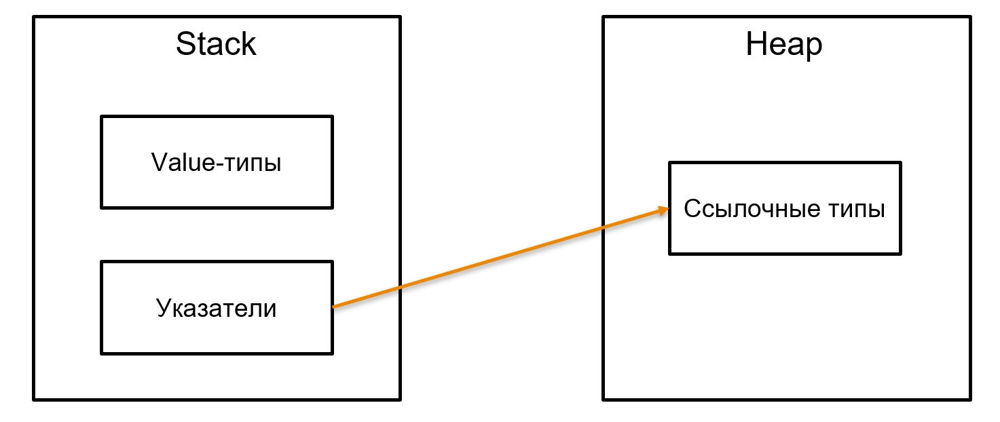

# Управление памятью

Обычно в языках программирования есть две области памяти — Stack и Heap:

На Stack (грубо говоря, это стек нашего метода) мы храним переменные, вызовы, указатели на ссылочные типы. А в Heap обычно хранится то, что называется ссылочными (reference) объектами — всё, что не примитив. String обычно хранится на Heap почти во всех языках, а на Stack лежат boolean, int и указатели на эти референсные типы.

Почему такие названия — Stack и Heap? Потому что Stack — это стек. Представьте стопку тарелок — это стек. Вы всегда берёте тарелку сверху. А Heap — это когда их в кучу навалили и каждую ищите по примерному адресу — надо искать смещение, коллектить и прочее:

В языке Go управление памятью осуществляется автоматически с помощью сборки мусора (garbage collection), что
освобождает разработчика от ручного управления памятью. Вот некоторые ключевые аспекты управления памятью в Go:

## Автоматическая сборка мусора

Go использует алгоритм сборки мусора с маркировкой и освобождением (mark-and-sweep). Во
время выполнения программы, сборщик мусора анализирует и маркирует все объекты, которые по-прежнему используются, а
затем освобождает память, занимаемую неиспользуемыми объектами.

## Указатели и выделение памяти

В Go есть возможность работы с указателями, но прямое выделение и освобождение памяти с
помощью указателей не поддерживается. Выделение памяти происходит автоматически при создании объектов и освобождение
памяти происходит автоматически при сборке мусора.

## Устранение утечек памяти

При правильном использовании Go управляет памятью и автоматически освобождает неиспользуемую
память. Однако, неправильное использование конструкций, таких как циклы ссылок или долгоживущие объекты, может
привести к утечкам памяти. Поэтому важно следить за правильным использованием ресурсов и избегать утечек памяти.

## Слайсы (slices)

В Go часто используются слайсы, которые представляют собой динамически изменяемые массивы. Слайсы
обеспечивают автоматическую расширяемость и управление памятью. При добавлении элементов в слайс или изменении его
размера, Go автоматически управляет памятью, выделяя новый участок памяти и копируя данные при необходимости.

## Стек и куча

В языке Go существуют две области памяти, известные как "стек" (stack) и "куча" (heap), которые используются для
размещения данных и объектов во время выполнения программы. Вот более подробное описание каждой области:

### Стек (Stack):

Стек представляет собой участок памяти, который используется для хранения локальных переменных и контекста вызова
функций. Каждый поток выполнения программы имеет свой собственный стек. Когда функция вызывается, данные, такие как
аргументы функции, локальные переменные и адрес возврата, сохраняются на вершине стека. Когда функция завершается, эти
данные удаляются из стека. Операции в стеке очень быстрые и эффективные. Размер стека ограничен и задается на этапе
компиляции.

### Куча (Heap):

Куча представляет собой область памяти, которая используется для динамического выделения памяти под объекты и данные,
которые не ограничены временем жизни функции. Объекты в куче могут быть доступны из разных частей программы и иметь
долгоживущий жизненный цикл. Например, это могут быть структуры данных, объекты классов или слайсы. Управление памятью в
куче осуществляется сборщиком мусора, который автоматически определяет, какая память больше не используется и
освобождает ее. Куча имеет больший размер, чем стек, и обычно является общей памятью для всей программы.

В целом, Go предоставляет разработчику простой и эффективный механизм управления памятью, освобождая его
от выделениея и освобождения памяти вручную, как в низкоуровневых языках программирования. Вместо этого, Go
автоматически управляет памятью через сборку мусора и предоставляет высокоуровневые конструкции, такие как слайсы и
указатели, для работы с данными. Это позволяет разработчику сосредоточиться на бизнес-логике приложения, а не на
управлении памятью.

## Escape analysis (эскейп анализ)

**Escape analysis (Escape analysis)** в языке Go является одной из оптимизаций компилятора, которая позволяет
определить,
будет ли объект или переменная "выброшена" из локальной области и будет ли использоваться вне нее. Этот анализ позволяет
определить, следует ли выделить память для объекта на куче или же можно использовать стек для его хранения. Вот
некоторые особенности анализа эскейпа в Go:

### Стековое распределение (Stack Allocation)

Escape analysis пытается найти переменные, которые могут быть безопасно
распределены на стеке вместо кучи. Это происходит, когда переменная не будет использоваться после выхода из локальной
области, например, когда она не передается в другие функции или не сохраняется для использования после возврата из
текущей функции.

### Кучевое распределение (Heap Allocation)

Если Escape analysis обнаруживает, что переменная будет использоваться за
пределами локальной области, то объект или переменная будет выделена на куче. Например, когда переменная передается по
указателю или сохраняется в глобальной области, она считается "выброшенной" из локальной области и требует распределения
памяти на куче.

### Оптимизации аллокаций

Escape analysis позволяет компилятору Go оптимизировать аллокации памяти. Если компилятор
обнаруживает, что объект может быть безопасно распределен на стеке, это может привести к повышению производительности,
так как стековые аллокации более эффективны и быстрые, чем кучевые аллокации.

Escape analysis в Go выполняется компилятором во время компиляции программы. Разработчику не требуется явно указывать,
где распределять объекты на стеке или куче - это определяется автоматически на основе анализа кода и его использования
переменных и объектов.Оптимизации, которые происходят благодаря анализу эскейпа, позволяют Go достигать высокой
производительности и
эффективного использования памяти, освобождая разработчика от необходимости явно управлять памятью.

*Дополнительно:*

- [Механизмы выделения памяти в Go](https://habr.com/ru/company/ruvds/blog/442648/)

